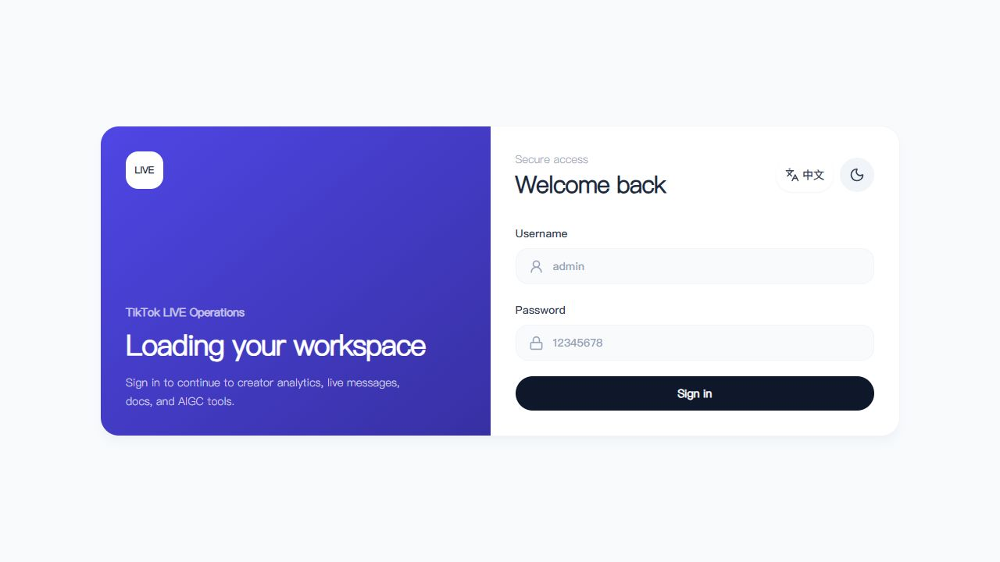
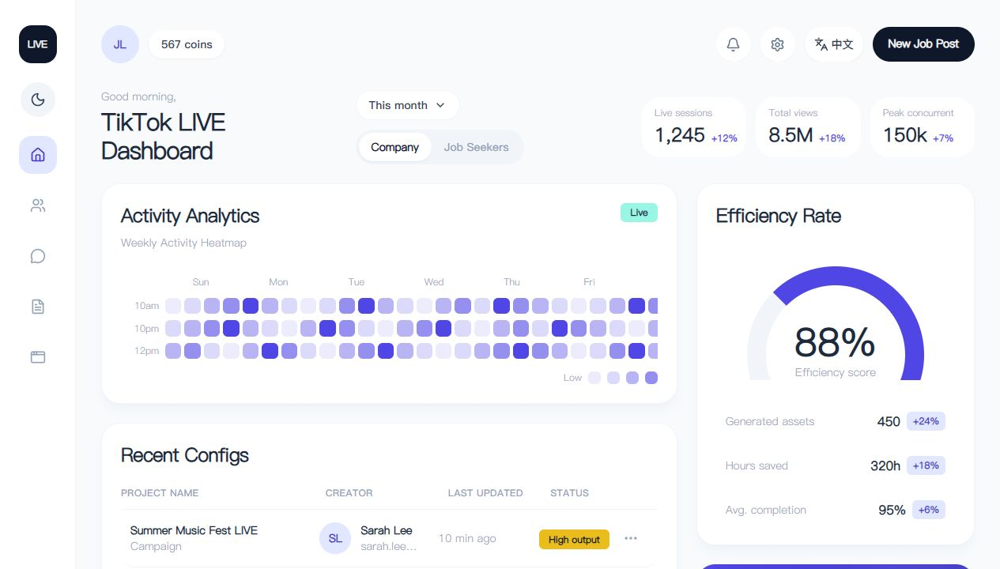
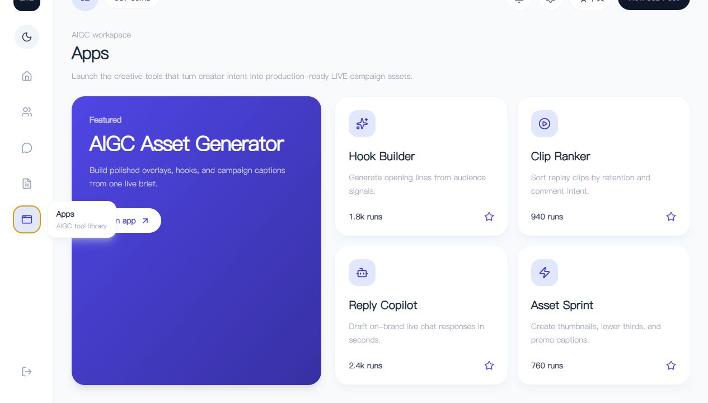

# TikTok LIVE B-End Demo


TikTok LIVE B-End Demo is a polished React + Vite dashboard prototype for creator operations, LIVE campaign monitoring, AIGC asset workflows, and backend API integration.

中文：这是一个面向 TikTok LIVE 运营后台的 React + Vite 演示项目，覆盖登录鉴权、运营数据看板、达人管理、活动素材、消息中心和 AIGC 工具库等典型后台场景。

## Live Preview / 在线预览

- Preview URL / 访问链接: [https://mark-maker006.github.io/tiktok-demo/](https://mark-maker006.github.io/tiktok-demo/)
- Username / 账号: `admin`
- Password / 密码: `12345678`

## Screenshots / 界面截图

### Login Gateway / 登录入口



### Operations Dashboard / 运营总览



### AIGC Tool Library / AIGC 工具库



## Highlights / 项目亮点

### English

- Clean B-end dashboard layout built with React, Vite, Tailwind CSS, and Lucide icons.
- Login gate with theme switch and bilingual language switching.
- Dashboard modules for LIVE sessions, total views, peak concurrent users, heatmap analytics, creator configs, and efficiency metrics.
- Extended views for creator ops, live message center, campaign documents, and AIGC app tools.
- Mock-driven data layer prepared for future backend integration.
- GitHub Actions workflow ready for GitHub Pages deployment.

### 中文

- 使用 React、Vite、Tailwind CSS 和 Lucide icons 构建的现代化后台界面。
- 支持登录入口、明暗主题切换和中英文语言切换。
- 首页包含直播场次、总观看量、峰值在线、活动热力图、达人配置和效率指标。
- 内置达人运营、消息中心、活动文档、AIGC 工具库等多个业务视图。
- 当前使用 mock 数据，方便后续平滑接入真实后端接口。
- 已配置 GitHub Actions，可自动构建并部署到 GitHub Pages。

## Tech Stack / 技术栈

| Area | Stack |
| --- | --- |
| Framework | React |
| Build Tool | Vite |
| Styling | Tailwind CSS |
| Icons | Lucide React |
| Deployment | GitHub Actions + GitHub Pages |

## Local Development / 本地开发

```bash
npm install
npm run dev
```

Default local URL / 默认本地地址:

```text
http://127.0.0.1:6006
```

If port `6006` is occupied, Vite may automatically use the next available port.

如果 `6006` 端口被占用，Vite 会自动切换到下一个可用端口。

## Production Build / 生产构建

```bash
npm run build
npm run preview
```

The production assets are generated into `dist/`.

生产构建产物会输出到 `dist/` 目录。

## Deployment / 部署

The project ships with a GitHub Actions workflow:

```text
.github/workflows/deploy.yml
```

When code is pushed to `master`, GitHub Actions will:

1. Install dependencies with `npm ci`
2. Build the Vite project with `npm run build`
3. Upload `dist/` as a GitHub Pages artifact
4. Publish the site to GitHub Pages

中文部署说明：

当代码推送到 `master` 分支后，GitHub Actions 会自动安装依赖、执行构建、上传 `dist/` 产物，并发布到 GitHub Pages。

## Project Structure / 项目结构

```text
src/
  app/                  # App bootstrap and root composition
  config/               # Theme tokens and build-time configuration
  features/
    auth/               # Login gate and auth-facing UI
    dashboard/          # Dashboard pages, components, and API adapters
  mocks/                # Temporary mock data before backend APIs are connected
  shared/
    api/                # Shared request client
    components/         # Reusable UI components
    contexts/           # App-level React contexts
    lib/                # Small shared utilities
```

## Backend Integration / 后端接入

Backend integration should start from:

```text
src/features/dashboard/api/dashboardApi.js
```

Set the API base URL in `.env.local`:

```bash
VITE_API_BASE_URL=http://127.0.0.1:8080
```

中文：后端接口建议从 `src/features/dashboard/api/dashboardApi.js` 开始替换 mock 数据，并在 `.env.local` 中配置 `VITE_API_BASE_URL`。
